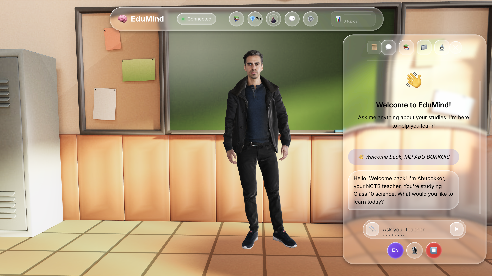
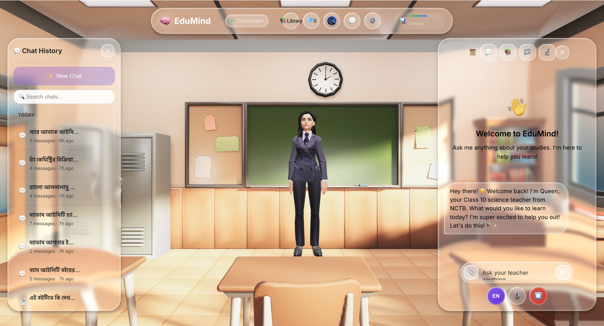
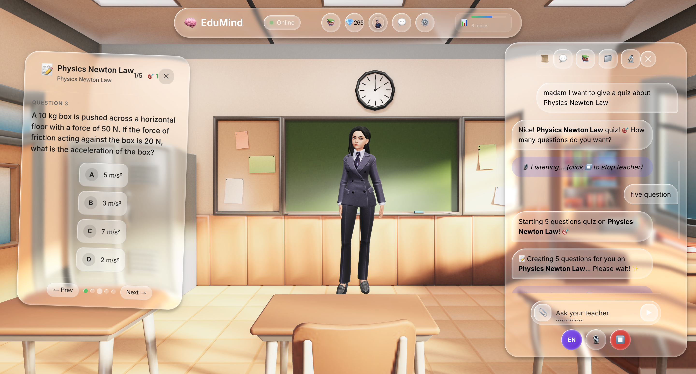
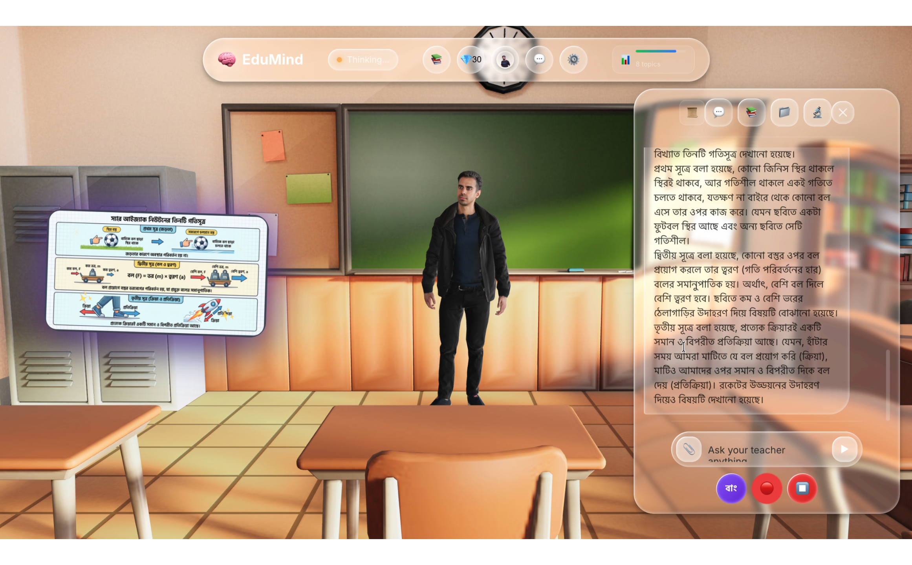
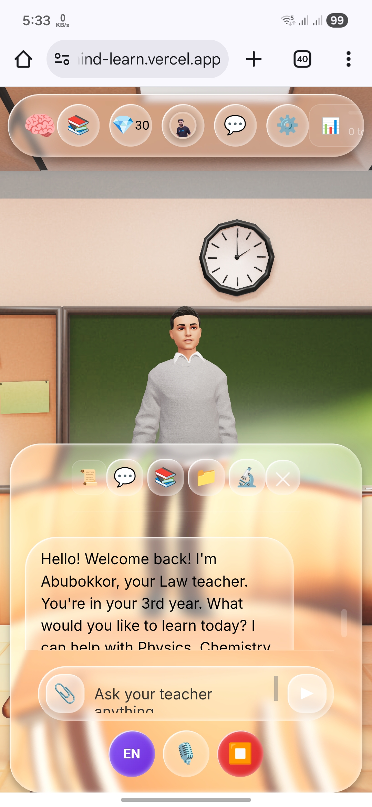
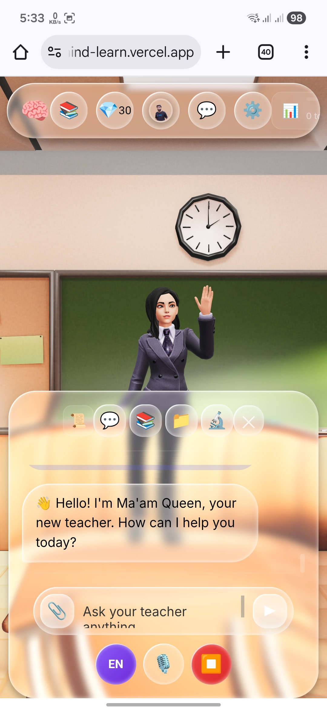
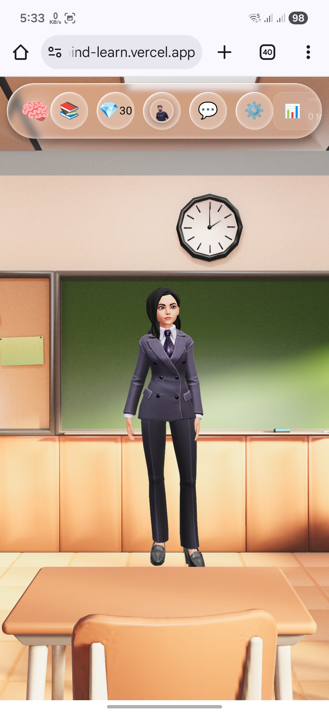

<p align="center">
  
</p>

<h1 align="center">INTELLA — AI Virtual Teacher</h1>

<p align="center">
  <strong>The world's first AI teaching platform with real-time lip-synced 3D avatars powered by Gemini Live API</strong>
</p>

<p align="center">
  <a href="https://ai.google.dev/"></a>
  <a href="https://ai.google.dev/"></a>
  <a href="https://ai.google.dev/"></a>
  <a href="LICENSE"></a>
</p>

<p align="center">
  <a href="#-whats-unique">What's Unique</a> •
  <a href="#-features">Features</a> •
  <a href="#%EF%B8%8F-live-api--lip-sync">Live API & Lip Sync</a> •
  <a href="#%EF%B8%8F-architecture">Architecture</a> •
  <a href="#-getting-started">Getting Started</a> •
  <a href="#-tech-stack">Tech Stack</a>
</p>

---

## 🎯 What's Unique

**260 million children worldwide lack access to quality education.** Current AI tools are text-based chatbots — smart, but cold. Students need a teacher they can *see, hear, and interact with naturally*.

INTELLA solves this with a **3D AI teacher avatar that speaks, emotes, and lip-syncs in real time** — not a chatbot, but a virtual classroom experience.

### The Core Innovation: Gemini Live API + Real-Time Lip Sync

| Capability | What It Does |
|:---|:---|
| **Real-time voice conversation** | Talk naturally with your AI teacher — interrupt, ask follow-ups, just like a real classroom |
| **Live lip-synced 3D avatar** | Avatar mouth movements match speech in real time using PCM amplitude-to-viseme mapping |
| **Live transcription** | Both student input and AI responses appear as text simultaneously |
| **Tool calling during voice** | Ask for images, quizzes, research — all while in voice conversation |
| **< 1200ms latency** | Near-instant responses via Gemini 2.5 Flash Native Audio |

> **No other AI education platform combines real-time voice, lip-synced 3D avatars, and multimodal tool calling in a single live session.**

---

## ✨ Features

### 🎙️ Live Conversation Mode

Full-duplex voice conversation with the AI teacher. Student speaks naturally, avatar responds with synchronized lip movements, facial expressions, and hand gestures.

- Real-time speech-to-text for both student and teacher
- Automatic interrupt handling — speak anytime to redirect
- Visual diagram generation mid-conversation (*"draw Newton's laws"*)
- Smart quiz generation mid-conversation (*"quiz me on photosynthesis"*)
- Deep research with Google Search grounding mid-conversation

### 💬 Text Chat Mode

Full-featured text input/output with rich markdown responses, code highlighting, and inline educational content.

- Context-aware conversation with chat history
- Markdown, LaTeX, and code rendering
- Voice output via Google Cloud TTS (70+ languages)
- Same five learning modes available as in live voice

### 🎭 Dual 3D Teacher Avatars

Choose between two realistic teachers, each with full emotional range:

<table width="100%">
  <tr>
    <td width="50%" align="center"></td>
    <td width="50%" align="center"></td>
  </tr>
  <tr>
    <td align="center"><strong>Sir INTELLA</strong> — Male Teacher</td>
    <td align="center"><strong>Ma'am Queen</strong> — Female Teacher</td>
  </tr>
</table>

- **8 emotional states**: neutral, happy, sad, angry, fear, disgust, love, sleep
- **8 hand gestures**: handup, index, ok, thumbup, thumbdown, side, shrug, namaste
- Dynamic mood transitions based on conversation context
- Breathing, blinking, eye contact, and idle animations

### 📚 Five Learning Modes

| Mode | Trigger | Description |
|:---|:---|:---|
| **💬 Chat** | Any question | General Q&A with context-aware responses |
| **📝 Quiz** | *"Quiz me on..."* | Auto-generated MCQs with adaptive difficulty via BKT algorithm |
| **🖼️ Image** | *"Draw / show / visualize..."* | AI-generated educational diagrams with Bengali text support |
| **🔍 Research** | *"Research / deep dive..."* | Google Search-grounded comprehensive reports |
| **📖 Curriculum** | *"Teach me from textbook..."* | RAG-powered lessons from NCTB / CBSE / Cambridge syllabi |

All five modes work in both **text chat** and **live voice** conversation.

### 📝 Smart Quiz System

<p align="center">
  
</p>

- Bayesian Knowledge Tracing (BKT) adapts difficulty in real time
- 85% accuracy in predicting student mastery level
- Tracks progress across subjects and topics
- Works in any language the student speaks

### 🖼️ AI Image Generation & Explanation

<p align="center">
  
</p>

- Generates educational diagrams, charts, and illustrations on demand
- Supports **Bengali text rendering** via Gemini 3 Pro Image
- After generating an image, the teacher **explains it** using Gemini Vision API
- Full-screen overlay display during explanation for immersive learning
- Works seamlessly in both Google TTS mode and Live API mode

### 🔍 Deep Research Mode

- Google Search-grounded research on any topic
- Structured reports: Overview → Key Concepts → Analysis → Applications → Recent Developments
- Full report appears in chat; teacher speaks a summary of key findings
- Available in both text and live voice modes

### 📱 Mobile Responsive

<table width="100%">
  <tr>
    <td width="33%" align="center"></td>
    <td width="33%" align="center"></td>
    <td width="33%" align="center"></td>
  </tr>
</table>

---

## 🎙️ Live API & Lip Sync

### How It Works

INTELLA's signature feature is **real-time lip sync during Gemini Live API voice conversations**. Here's the technical flow:

```
Student speaks → Browser mic → PCM16 audio → Gemini Live API (WebSocket)
                                                        ↓
Avatar lip sync ← TalkingHead streamAudio() ← PCM16 chunks ← Gemini response audio
       ↓
  _autoLipsyncFromPCM() analyzes 25ms segments → RMS amplitude → Viseme mapping
       ↓
  Viseme animation queue → aa / O / E / I mouth shapes → Smooth 30fps rendering
```

### Technical Details

| Component | Implementation |
|:---|:---|
| **Audio transport** | WebSocket with PCM16 @ 24000Hz sample rate |
| **Lip sync engine** | TalkingHead `streamStart()` → `streamAudio()` → `streamNotifyEnd()` |
| **Viseme generation** | `_autoLipsyncFromPCM()` — 25ms RMS analysis → amplitude-to-viseme mapping |
| **Mouth shapes** | 4 viseme levels: `aa` (wide open), `O` (rounded), `E` (medium), `I` (slight) |
| **Audio playback** | AudioWorklet-based streaming with buffered queue |
| **Fallback TTS** | Google Cloud TTS with `speakAudio()` + word-timing visemes |

### Live Mode Tool Calling

During a live voice session, the AI teacher can execute any of these tools without interrupting the conversation:

```
┌─────────────────────────────────────────────────────────┐
│                  LIVE CONVERSATION TOOLS                  │
├─────────────────────────────────────────────────────────┤
│  🖼️  generate_image      → Educational diagram/chart    │
│  📝  generate_quiz       → Interactive MCQ overlay       │
│  🔍  deep_research       → Google Search-grounded report │
│  📊  show_student_progress → Mastery dashboard           │
│  🃏  generate_flashcards  → Study flashcard deck         │
└─────────────────────────────────────────────────────────┘
```

---

## 🏗️ Architecture

```mermaid
graph TB
    subgraph Client["Client — Browser"]
        A[3D Avatar<br/>Three.js + TalkingHead]
        B[Chat UI<br/>Text Input/Output]
        C[Voice Input<br/>Web Speech API]
        D[Live Mic<br/>PCM16 Streaming]
    end

    subgraph Core["Core Engine"]
        E[Message Router]
        F[Intent Detector]
        G[Context Manager<br/>Chat History]
        H[Credit System]
    end

    subgraph Modes["Learning Modes"]
        M1[💬 Chat]
        M2[📝 Quiz]
        M3[🖼️ Image]
        M4[🔍 Research]
        M5[📖 Curriculum]
    end

    subgraph Gemini["Gemini API"]
        G1[Gemini 3 Flash<br/>Chat / Quiz / Research]
        G2[Gemini 3 Pro Image<br/>Diagram Generation]
        G3[Gemini 2.5 Flash Audio<br/>Live API — Voice + Tools]
        G4[Google Cloud TTS<br/>70+ Languages]
    end

    subgraph Backend["Backend Services"]
        B1[(Firebase Auth)]
        B2[(Firestore DB)]
        B3[(IndexedDB<br/>Offline Cache)]
        B4[Stripe Payments]
    end

    D -->|WebSocket PCM16| G3
    G3 -->|PCM16 + Transcripts| A
    C --> E
    B --> E
    E --> F
    F --> M1 & M2 & M3 & M4 & M5
    M1 --> G1
    M2 --> G1
    M3 --> G2
    M4 --> G1
    M5 --> G1
    G1 --> A
    G2 --> A
    G4 --> A
    G --> B1 & B2 & B3
    H --> B4
```



### Multi-Model Orchestration

| Task | Model | Why |
|:---|:---|:---|
| Chat, Quiz, Research | `gemini-3-flash-preview` | 1M token context, fast inference |
| Image Generation | `gemini-3-pro-image-preview` | Accurate Bengali text rendering |
| Live Voice + Tools | `gemini-2.5-flash-native-audio-preview` | Real-time bidirectional audio streaming |
| Text-to-Speech | Google Cloud TTS | 70+ languages, natural prosody |

---

## 🚀 Getting Started

### Prerequisites

- Node.js 18+
- Gemini API key — [Get one here](https://ai.google.dev/)
- Firebase project (for authentication and database)

### Installation

```bash
# Clone the repository
git clone https://github.com/INTELLA-cse/INTELLA-AI-Virtual-Teacher.git
cd INTELLA-AI-Virtual-Teacher

# Install dependencies
npm install
```

### Environment Setup

Create a `.env` file in the project root:

```env
GEMINI_API_KEY=your_gemini_api_key
GOOGLE_TTS_API_KEY=your_google_tts_key
FIREBASE_CONFIG=your_firebase_config_json
STRIPE_SECRET_KEY=your_stripe_key
```

### Run

```bash
npm start
```

Open `http://localhost:3000` and start learning.

### Quick Start Guide

1. Click the **LIVE** button to start a voice conversation
2. Say *"Teach me about photosynthesis"* — watch the avatar explain with lip sync
3. Say *"Draw a diagram"* — image generates while you're talking
4. Say *"Quiz me"* — interactive quiz appears mid-conversation

---

## 📊 Tech Stack

| Layer | Technology |
|:---|:---|
| **AI Models** | Gemini 3 Flash, Gemini 3 Pro Image, Gemini 2.5 Flash Native Audio |
| **3D Rendering** | Three.js, TalkingHead (custom fork with streaming lip sync) |
| **Frontend** | Vanilla JS, CSS3 (Liquid Glass design system) |
| **Voice** | Google Cloud TTS (70+ languages), Web Speech API, Gemini Live API |
| **Learning Algorithm** | Bayesian Knowledge Tracing (BKT) — 85% mastery prediction accuracy |
| **Auth & Database** | Firebase Authentication, Firestore, IndexedDB (offline) |
| **Payments** | Stripe (global credit-based billing) |
| **Deployment** | Vercel (Edge Functions), CDN |

---

## 🤝 Contributing

1. Fork the repository
2. Create a feature branch: `git checkout -b feature/your-feature`
3. Commit changes: `git commit -m "Add your feature"`
4. Push: `git push origin feature/your-feature`
5. Open a Pull Request

---

## 📄 License

MIT License — see [LICENSE](LICENSE) for details.

---

## 📧 Contact

**INTELLA Team** — Creator & Lead Developer

[](https://www.linkedin.com/in/md-INTELLA/)
[](https://github.com/INTELLA-cse)

---

<p align="center">
  <strong>Built with ❤️ in Bangladesh</strong><br/>
  <em>"Every child deserves a teacher who never gives up on them."</em>
</p>


